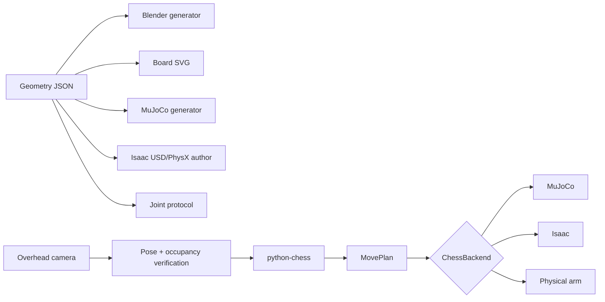

# SO-101 fixed micro-chess system

Status: **engineering package implemented; all-square vertical grasp IK passes; curved-path and physical gates remain**. This document is the architectural source of truth. The adjoining runbooks contain commands and operator checklists.

## Goal and design decision

One fixed SO-101 arm will manipulate a complete 8×8 chess position. A normal 34 cm board is outside the reliable reach envelope. A first 25 mm design passed a radial calculation but visual simulation placed its near ranks too deeply under the shoulder envelope. The implemented design therefore uses:

| Property | Implemented value |
|---|---:|
| Square pitch | **23 mm** |
| Playfield | **184 × 184 mm** |
| Carrier | **204 × 204 × ≤4 mm** |
| Playfield near edge | **85 mm from pan pivot** |
| Carrier near edge | **75 mm from pan pivot** |
| Square-center reach | **97–270 mm** |
| Piece base | **14 mm diameter × 8 mm tall** |
| Piece height | **30 mm** |
| Common grasp mast | **7 mm diameter × 18 mm, starting 10 mm up** |
| Tool | **stock SO-101 jaws** (finger extensions off) |
| Chute mouth | **(150, ±128) mm, 40 × 40 mm** |
| Discard tray | **(90, ±360) mm, 16 slots at 18 mm pitch** |

The 23 mm pitch vs stock jaws is the tight gate. The five-piece crowded-clearance coupon is still blocking before full-set fabrication.

## System architecture



Python Chess is authoritative for legality and identity. Vision verifies board pose and occupancy, not full piece classification. Engine state advances only after the physical/simulated action and a matching observation.

## Coordinate and board convention

- Origin: center of the follower pan axis.
- `+X`: forward into the board.
- `+Y`: robot’s left.
- `+Z`: upward.
- Rank 1 is nearest the robot; a-file is on the robot’s left.
- Playfield: `X=85…269 mm`, `Y=-92…92 mm`.
- Carrier: `X=75…279 mm`, `Y=-102…102 mm`.

For file index `a=0 … h=7` and rank `1…8`:

```text
X = 85 + (rank - 0.5) × 23 mm
Y = 80.5 - file_index × 23 mm
```

All consumers call `ChessGeometry.square()`; they must not reproduce this formula independently.

## Physical concept

The stock wrist/jaw assembly is wider than the 23 mm pitch, so the pieces — not the tool — take the clearance. Each piece is a short 14 mm stump with a 7 mm mast the jaws close on above neighbour bodies. Neighbour masts at jaw height are 7 mm, so the ~26×12 mm stock jaw envelope can wrap one mast without clipping the next. The 8×8 / 23 mm board is unchanged; a 34 mm-pitch 8×8 still does not fit the 300 mm reach envelope.

```text
stock SO-101 jaws          ~26 × 12 mm at grasp height
 ┌─────────────────┐
 └─┐             ┌─┘
   │    7 mm     │     close above the stumps
   └─▌  mast    ▐─┘
         ║
      8 mm stump           14 mm weighted base
   ┌───────────┐
   └───────────┘
```

Finger-extension STLs remain in the asset pack as fit-check prototypes; `use_finger_extensions` is false.

## Move transaction

`MovePlan` expands a legal UCI move into ordered manipulation steps:

1. Remove a captured piece, including the actual en-passant capture square.
2. Move the source piece to the destination.
3. Move the rook for castling.
4. Pause for an operator piece swap on promotion.
5. Observe the board again.
6. Commit the move to Python Chess only if occupancy and board pose match.

On uncertainty, capture one fresh observation and stop for operator correction. Never repeat an arm move blindly.

## Backends and limitations

- **MuJoCo:** runnable scene and kinematic chess backend. It proves coordinates, legal mechanics, occupancy, rendering, and transport. The current backend teleports free-joint pieces; it does not claim dynamic grasp success.
- **Isaac/LeIsaac:** Runpod bootstrap, PhysX stage authoring, custom environment installer, remote teleoperation, HDF5 recording, and Dataset v3 conversion are implemented but require the cloud GPU to execute.
- **Physical arm:** a dependency-injected `PhysicalChessBackend` is implemented without import-time serial side effects. Existing LeRobot/gemini helpers remain the hardware base; the coupon-tested `pick_and_place`/`capture_to_bin` primitive is intentionally not wired to live hardware until measured tool calibration and curved contact-safe paths pass.

## Runbooks

- [Fabrication](fabrication.md)
- [MuJoCo](mujoco.md)
- [Isaac and Runpod](isaac.md)
- [Teleoperation](teleoperation.md)
- [Calibration and validation](validation.md)

## Completion gates

1. Generated artifacts and automated tests pass.
2. All 64 square poses pass downward-IK, joint-margin, path-step, and collision checks.
3. Five-piece coupon achieves at least 29/30 successful transfers with zero neighbor contacts.
4. Equivalent scripted move suites pass in MuJoCo and Isaac.
5. One physical source-to-destination transfer passes verification repeatedly.
6. Captures, both castlings, en passant, promotion pause, illegal-move rejection, disturbances, and emergency stop pass end-to-end.


## Captured pieces leave the workspace

A game produces up to 15 captures per colour. The original 40 × 40 × 20 mm
capture cups hold four 14 mm pieces per layer and their walls are shorter than
a 24 mm piece, so they cannot retain a stack. Nothing caught this until the
physics-stepped backend dropped a second capture onto the first: the kinematic
backend had been teleporting captures onto a 10 mm grid, which overlaps 14 mm
pieces — a placement that was never physically possible.

Captures are therefore routed off the board:

```text
     square ──carry──► chute mouth ──release──►  funnel  ──►  discard tray
                    (150, ±128) mm                            (90, ±360) mm
                    validated route                           outside reach
```

The mouth keeps its original coordinates, so all 130 validated baseline routes
— including `capture_bin:white` and `capture_bin:black` — remain bit-identical
and needed no re-validation.

The tray sits 339–404 mm from the pan pivot against roughly 306 mm of arm. That
distance is the design: **an unreachable tray needs no occupancy model.** A tray
beside the board would put capture history back into the planning state, which
is what produced the failure in the first place — the drop pose never advanced
and bin fill was not even part of the cache key.

### The modelling boundary, stated

The funnel's interior is not simulated. What is simulated is the part that can
affect the robot: the piece is carried to the mouth, released, and **verified**
to have left the tool and settled inside the mouth footprint before it is
moved to the tray. If it does not settle there, the move fails.

The fabricated chute is what makes that boundary true. It is a passive sloped
funnel from each mouth to its tray, and it is a required part — without it,
released pieces stay at the mouth and the second capture repeats the original
collision.
