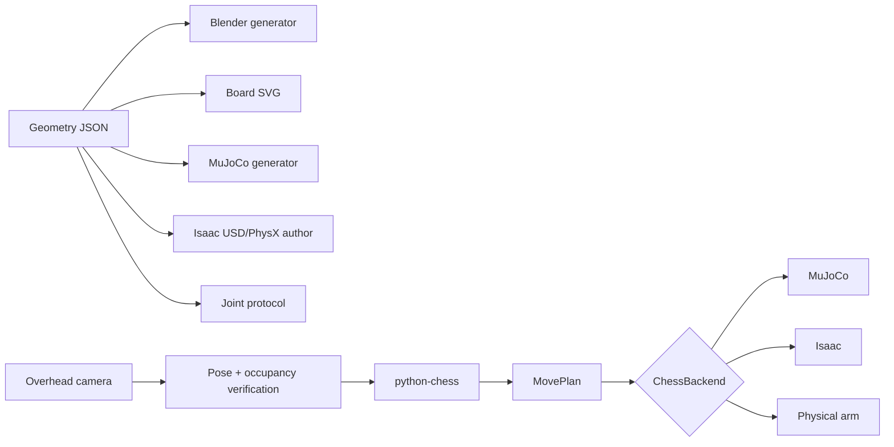

# SO-101 fixed micro-chess system

Status: **engineering package implemented; all-square vertical grasp IK passes; curved-path and physical gates remain**. This document is the architectural source of truth. The adjoining runbooks contain commands and operator checklists.

## Goal and design decision

One fixed SO-101 arm will manipulate a complete 8×8 chess position. A normal 34 cm board is outside the reliable reach envelope. A first 25 mm design passed a radial calculation but visual simulation placed its near ranks too deeply under the shoulder envelope. The implemented design therefore uses:

| Property | Implemented value |
|---|---:|
| Square pitch | **23 mm** |
| Playfield | **184 × 184 mm** |
| Carrier | **204 × 204 × ≤4 mm** |
| Playfield near edge | **85 mm from pan pivot** |
| Carrier near edge | **75 mm from pan pivot** |
| Square-center reach | **97–270 mm** |
| Piece base | **14 mm diameter** |
| Piece height | **24 mm** |
| Common grasp mast | **7 mm diameter** |
| Finger extension | **20 mm nominal** |
| Open tool envelope | **≤19 mm** |

The 4 mm open-tool clearance is intentional but tight. It makes the five-piece crowded-clearance coupon a blocking gate before full-set fabrication.

## System architecture



Python Chess is authoritative for legality and identity. Vision verifies board pose and occupancy, not full piece classification. Engine state advances only after the physical/simulated action and a matching observation.

## Coordinate and board convention

- Origin: center of the follower pan axis.
- `+X`: forward into the board.
- `+Y`: robot’s left.
- `+Z`: upward.
- Rank 1 is nearest the robot; a-file is on the robot’s left.
- Playfield: `X=85…269 mm`, `Y=-92…92 mm`.
- Carrier: `X=75…279 mm`, `Y=-102…102 mm`.

For file index `a=0 … h=7` and rank `1…8`:

```text
X = 85 + (rank - 0.5) × 23 mm
Y = 80.5 - file_index × 23 mm
```

All consumers call `ChessGeometry.square()`; they must not reproduce this formula independently.

## Physical concept

The stock wrist/jaw assembly is wider than the board pitch. Two removable keyed extensions act as short tweezers. Only their narrow tips descend among neighboring pieces; the stock jaw remains about 10 mm above the common 24 mm piece height.

```text
stock gripper body
 ┌─────────────────┐
 └─┐             ┌─┘   keyed + M3 retained
   │             │     20 mm nominal extensions
   │             │
   └─▌ 7 mm mast▐─┘   ≤19 mm open envelope
         ║
      chess piece      14 mm weighted base
   ┌───────────┐
   └───────────┘
```

The generated extension roots are fit-check prototypes because the physical jaw interfaces have not yet been caliper-measured. Their tip envelope, piece mast, and board pitch are contractual; revise only the root fit during the coupon iteration.

## Move transaction

`MovePlan` expands a legal UCI move into ordered manipulation steps:

1. Remove a captured piece, including the actual en-passant capture square.
2. Move the source piece to the destination.
3. Move the rook for castling.
4. Pause for an operator piece swap on promotion.
5. Observe the board again.
6. Commit the move to Python Chess only if occupancy and board pose match.

On uncertainty, capture one fresh observation and stop for operator correction. Never repeat an arm move blindly.

## Backends and limitations

- **MuJoCo:** runnable scene and kinematic chess backend. It proves coordinates, legal mechanics, occupancy, rendering, and transport. The current backend teleports free-joint pieces; it does not claim dynamic grasp success.
- **Isaac/LeIsaac:** Runpod bootstrap, PhysX stage authoring, custom environment installer, remote teleoperation, HDF5 recording, and Dataset v3 conversion are implemented but require the cloud GPU to execute.
- **Physical arm:** a dependency-injected `PhysicalChessBackend` is implemented without import-time serial side effects. Existing LeRobot/gemini helpers remain the hardware base; the coupon-tested `pick_and_place`/`capture_to_bin` primitive is intentionally not wired to live hardware until measured tool calibration and curved contact-safe paths pass.

## Runbooks

- [Fabrication](fabrication.md)
- [MuJoCo](mujoco.md)
- [Isaac and Runpod](isaac.md)
- [Teleoperation](teleoperation.md)
- [Calibration and validation](validation.md)

## Completion gates

1. Generated artifacts and automated tests pass.
2. All 64 square poses pass downward-IK, joint-margin, path-step, and collision checks.
3. Five-piece coupon achieves at least 29/30 successful transfers with zero neighbor contacts.
4. Equivalent scripted move suites pass in MuJoCo and Isaac.
5. One physical source-to-destination transfer passes verification repeatedly.
6. Captures, both castlings, en passant, promotion pause, illegal-move rejection, disturbances, and emergency stop pass end-to-end.
